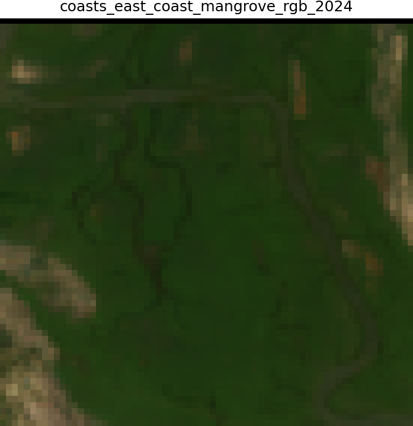
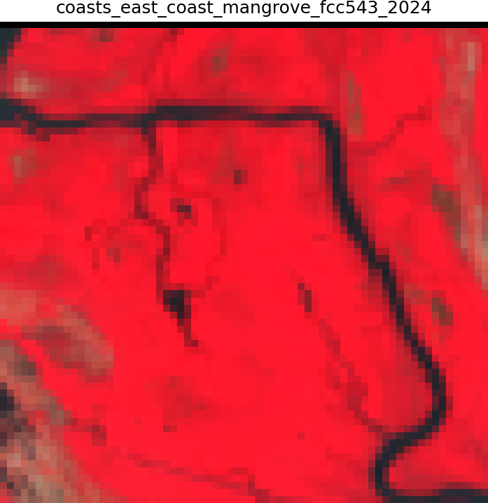
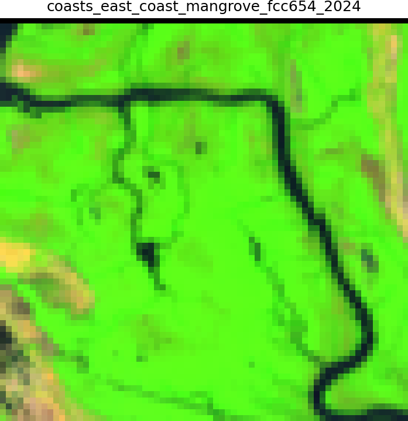
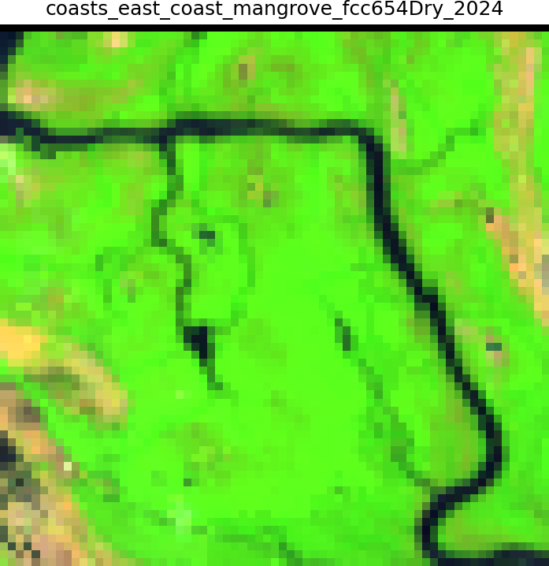
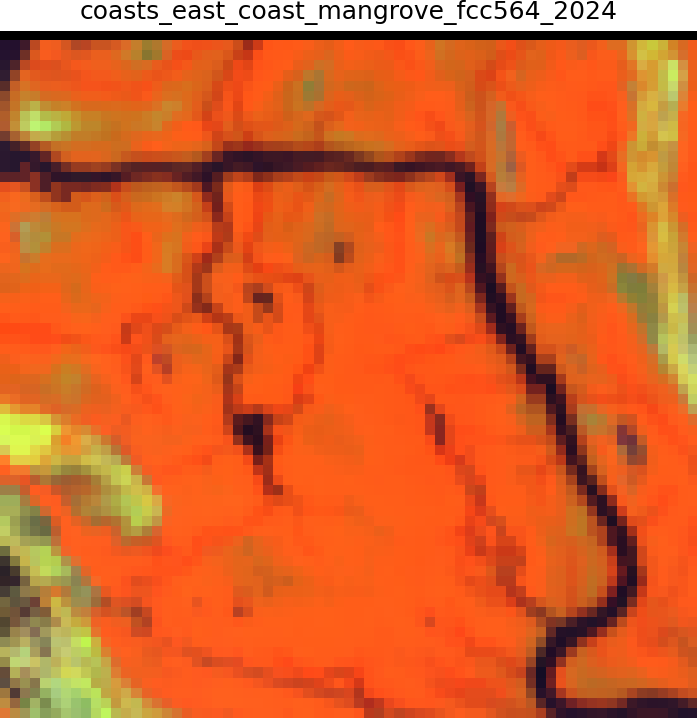

# Mangrove forest

| Legend | Level | Class Number | Color Code |
| ------ | ----- | -------------| ---------- |
| Mangrove Forest | 1.1 | 5 | #04381d |

## Definition

**Tidally influenced coastal forest ecosystems dominated by halophytic woody species adapted to saline conditions and regular inundation.**

Mangroves comprise specialised salt-tolerant tree and shrub communities occurring in tropical and subtropical intertidal zones, characterised by pneumatophores, prop roots, and vivipary. In India, they range from the extensive Sundarbans (dominated by Heritiera and Excoecaria) in the east to smaller patches along the western coast (dominated by Avicennia and Rhizophora), with structural complexity varying from tall closed canopies to stunted shrubby formations based on salinity and tidal amplitude. These ecosystems show minimal seasonal variation in canopy cover but may exhibit phenological changes in flowering and fruiting.

## True and false colour composites characteristics

- In RGB  (4-3-2) composites, mangroves appear dark green to brownish-green.
- In NIR-R-G (5-4-3), they show bright red to crimson due to high chlorophyll content and moisture.
- In SWIR-NIR-R (6-5-4), they appear bright green as strong reflectance is seen in the NIR channel.  
- Seasonal variations are subtle with slightly darker tones during monsoon months due to increased moisture and sediment load in surrounding waters  whilst tidal variations can affect spectral signatures based on water levels during image acquisition.

## Texture, shape and pattern

- Texture: Medium to coarse
- Shape: Varrying
- Pattern: Irregular

 ## Examples

### COASTS - East Coast - Sample 106 

| Satellite | Landsat (RGB)-4/3/2 | Landsat (NIR/R/G) - 5/4/3 |
|-----------|---------------------|----------------------------|
|  | 
 | 
 |
| Landsat (SWIR-NIR-R) - 6/5/4 | Landsat (SWIR-NIR-R) - Dry | Landsat (NIR/SWIR/R) - 5/6/4 |
|  | 
 | 
 |
| Google Earth Pro (optional) |  |  |
|  |  |  

### Islands - Sample xxx

*Add notes about region here.*

