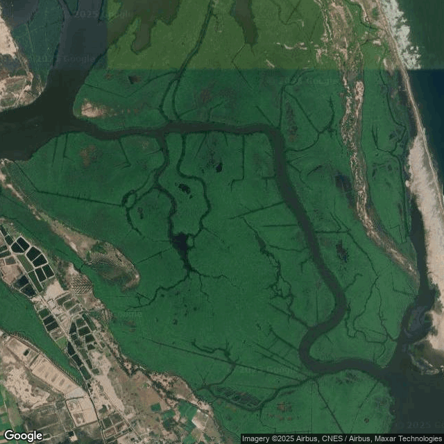

# Evergreen Forests

| Legend | Level | Class Number | Color Code |
| ------ | ----- | -------------| ---------- |
| Evergreen Forest | 1.2 | 3 | ##1f8d49 |

## Definition

**Forests maintaining green foliage throughout the year with less than 25% deciduous species, typically occurring in areas receiving over 2000mm annual rainfall or in temperature-limited high elevation zones.** 

These forests encompass tropical wet evergreens of the Western Ghats and North-East (dominated by Dipterocarpus, Mesua, Hopea), semi-evergreens with 25–75% evergreen species, montane temperate forests (including Quercus, Rhododendron), and coniferous formations (Pinus, Cedrus, Abies) of the Himalayas.

They exhibit a multi-layered canopy structure with emergents reaching 45–60 m in tropical zones, dense understory vegetation including bamboo patches, and high epiphytic loads in humid regions.

Whilst maintaining year-round green cover, these forests show subtle phenological patterns in leaf flush, flowering, and fruiting cycles.
## Description

 Evergreen forests are landcover types characterized by dense tree canopy cover where the majority of trees retain their leaves throughout the year. In landcover classification, evergreen forests are identified by persistent green foliage, minimal seasonal leaf loss, and a closed canopy structure. They are distinguished from deciduous forests by their year-round photosynthetic activity and stable canopy appearance.

 ## Examples

### Western Ghats - Sample 76

Evergreen species constitute at least 95% of the stand.  
Dense evergreen and semi-evergreen forests contrast sharply with the deciduous forests during dry period.

| Satellite | Landsat (RGB)-4/3/2 | Landsat (NIR/R/G) - 5/4/3 |
|-----------|---------------------|----------------------------|
|  |  |  |
| Landsat (SWIR-NIR_R) - 6/5/4 | Landsat (SWIR-NIR_R) - Dry | Landsat (NIR/SWIR/R) - 5/6/4 |
|  |  |  |
| Google Earth Pro (optional) |  |  

### Himalayas

*Add notes about region here.*

