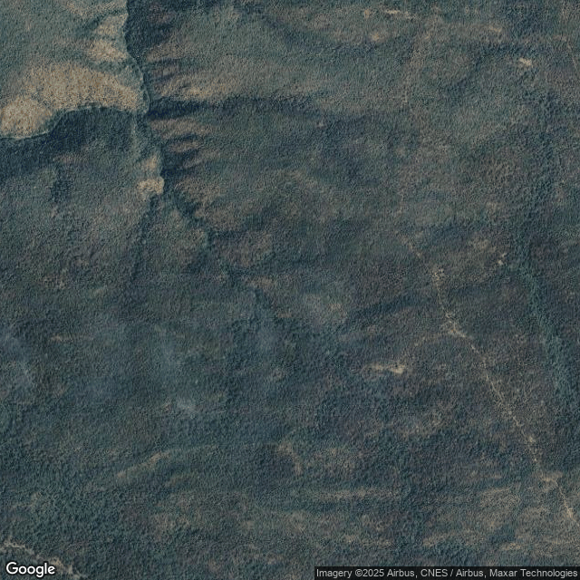
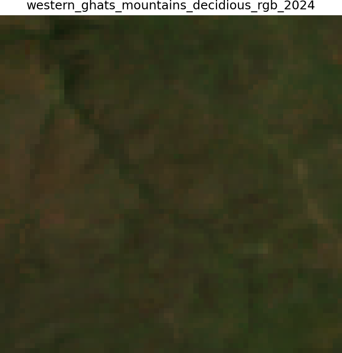
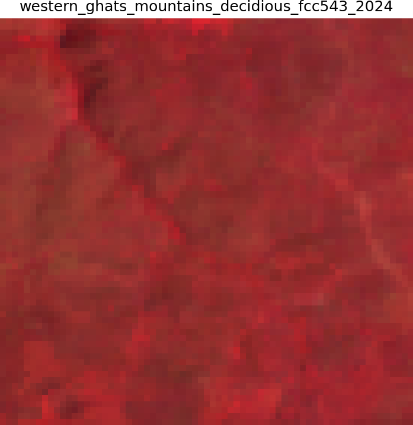
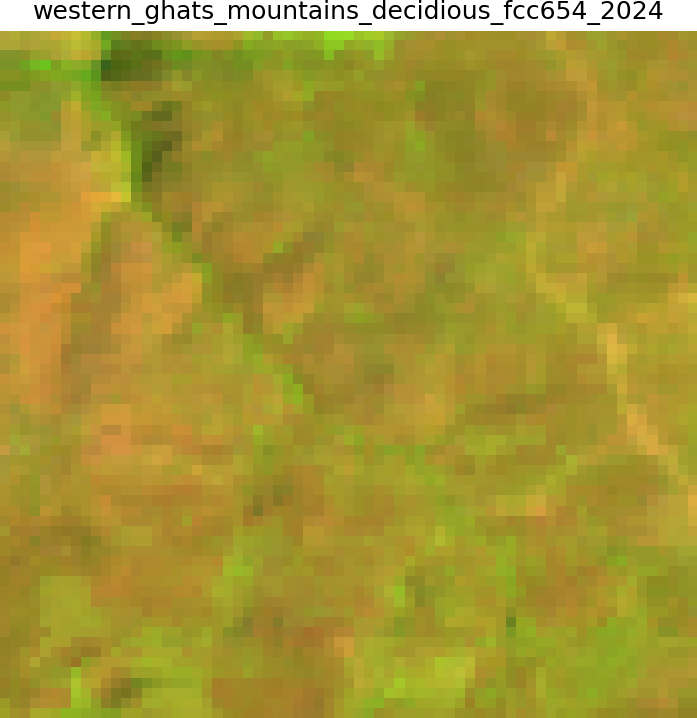
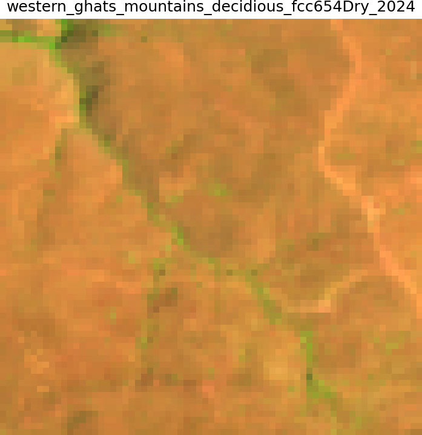
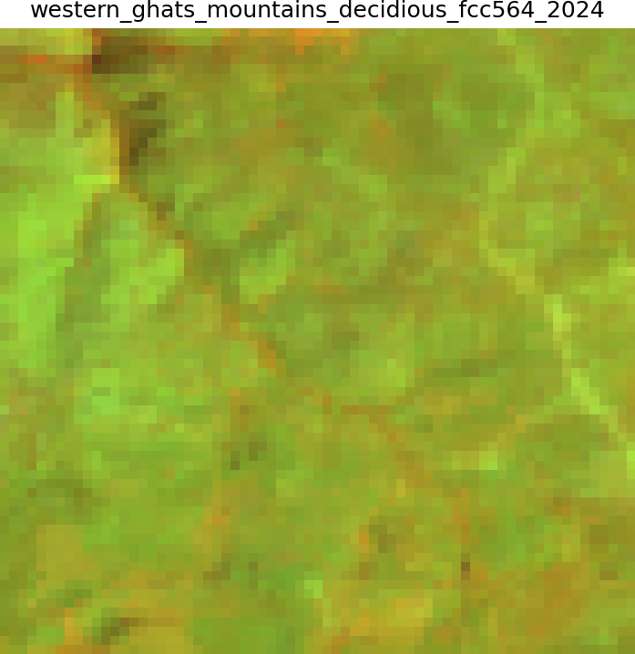

# Grass lands

| Legend | Level | Class Number | Color Code |
| ------ | ----- | -------------| ---------- |
| Grassland | 2.1 | 12 | #d6bc74 |

## Definition

** Areas dominated by graminoid vegetation with less than 10% tree cover and less than 20% shrub cover, ranging from tropical lowlands to alpine meadows.** 

Indian grasslands include Terai alluvial grasslands with tall grasses (Saccharum, Phragmites) reaching 3-5m height, semi-arid grasslands of the Deccan dominated by Sehima-Dichanthium communities, alpine meadows above treeline with Danthonia, Festuca, and cushion plants, and seasonal grasslands in forest clearings. These ecosystems show strong seasonal patterns tied to monsoon cycles, with peak biomass in the post-monsoon period and senescence during dry months, except alpine meadows showing summer growth patterns. Grass height, density, and species composition vary with moisture gradients, soil types, grazing pressure, and fire regimes.

## True and false colour composites characteristics

- In RGB (432), grasslands appear light green to golden-brown depending on season.
- In NIR-R-G (543), they show moderate red during the growing season, fading to brown in dry periods
- in SWIR-NIR-R (654), they show beige-pink colors. 
- Seasonal NDVI variations are pronounced (0.2-0.6), with rapid greening after monsoon onset and gradual senescence through the dry season
- Burnt areas show distinctive black signatures temporarily

## Texture, shape and pattern

- Texture: Smooth
- Shape: Irregular
- Pattern: Shattered

## Examples

### Western Ghats - Mountains - Sample 20

| Satellite | Landsat (RGB)-4/3/2 | Landsat (NIR/R/G) - 5/4/3 |
|-----------|---------------------|----------------------------|
|  |  |  |
| Landsat (SWIR-NIR_R) - 6/5/4 | Landsat (SWIR-NIR_R) - Dry | Landsat (NIR/SWIR/R) - 5/6/4 |
|  |  |  |
| Google Earth Pro (optional) |  |  

