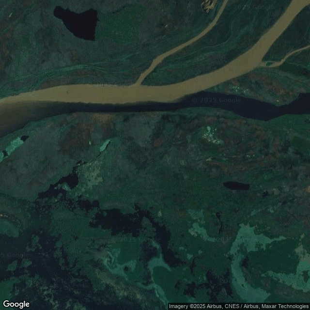
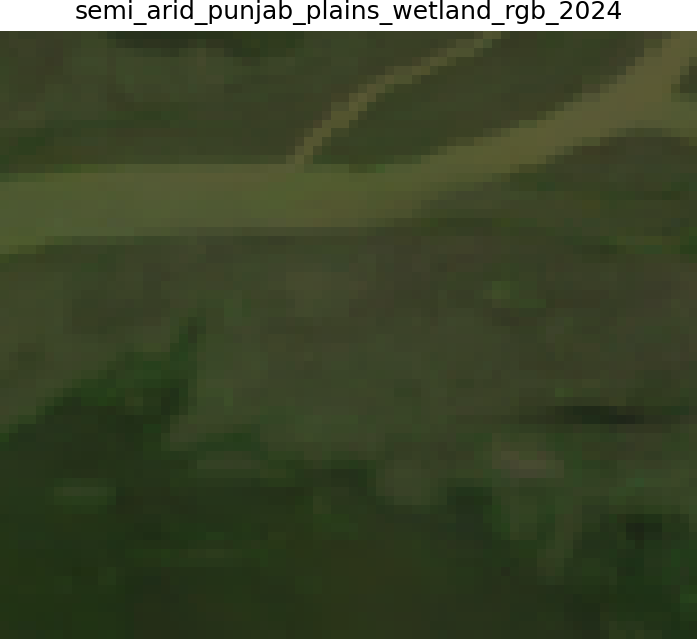
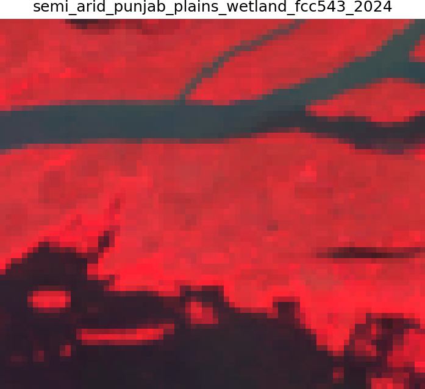
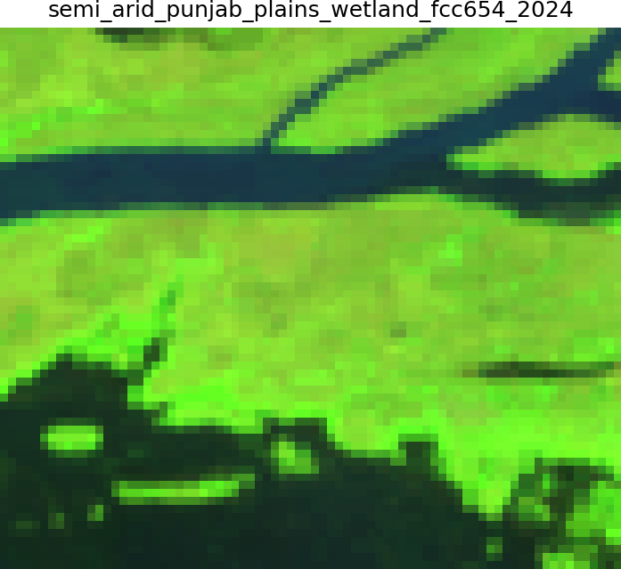
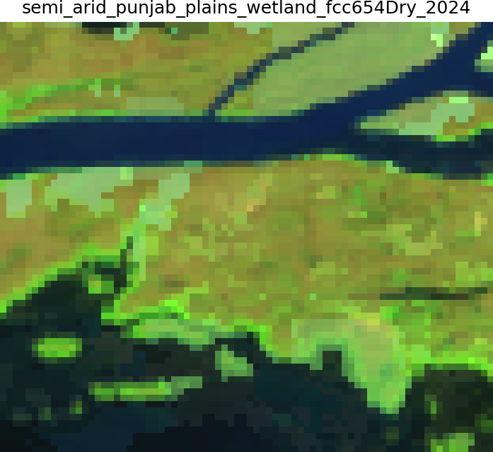
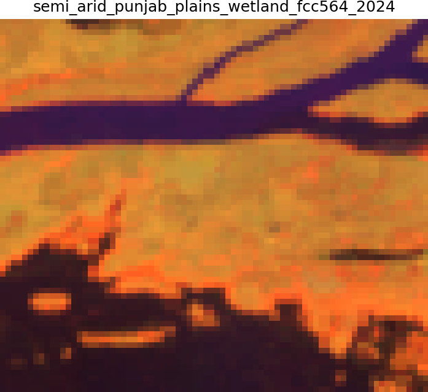

# Wetlands and marshlands

| Legend | Level | Class Number | Color Code |
| ------ | ----- | -------------| ---------- |
| Deciduous Forest | 2.2 | 11 | #519799 |

## Definition

**Areas where water is at, near, or above the land surface for sufficient time to support hydrophytic vegetation, including marshes, swamps, and seasonally flooded grasslands.** 

Wetlands comprise permanent marshes with emergent vegetation (Typha, Cyperus), seasonal floodplains with flood-adapted grasses and sedges, freshwater swamps with hydrophytic shrubs and trees, and floating/submerged aquatic vegetation in shallow water bodies. These systems show strong hydroperiod influences, with vegetation composition and structure varying from permanently inundated areas with floating plants to seasonally flooded zones with flood-tolerant terrestrial species. Regional examples include Kashmir wetlands with Phragmites reed beds, Loktak's floating phumdis in Manipur, and extensive Keoladeo-type seasonal wetlands in the Gangetic plains.

## True and false colour composites characteristics

- In RGB (432), wetlands appear dark green to blue-green with water showing through vegetation
- In NIR-R-G (543), they show variable red tones depending on vegetation density, with open water appearing black
- In SWIR-NIR-R (654), wetlands display bright greenish tones. 
- Seasonal variations are dramatic, with monsoon/post-monsoon showing extensive water and lush vegetation signatures, whilst the dry season may show exposed soil or dried vegetation. This temporal variability is key for wetland identification and classification. This should also show in the NDVI plots. 

## Texture, shape and pattern

- Texture: Medium to coarse
- Shape: Varrying
- Pattern: Irregular

## Examples

### Semi- Arid - Punjab plains - Sample 78

| Satellite | Landsat (RGB)-4/3/2 | Landsat (NIR/R/G) - 5/4/3 |
|-----------|---------------------|----------------------------|
|  |  |  |
| Landsat (SWIR-NIR_R) - 6/5/4 | Landsat (SWIR-NIR_R) - Dry | Landsat (NIR/SWIR/R) - 5/6/4 |
|  |  |  |
| Google Earth Pro (optional) |  |  

