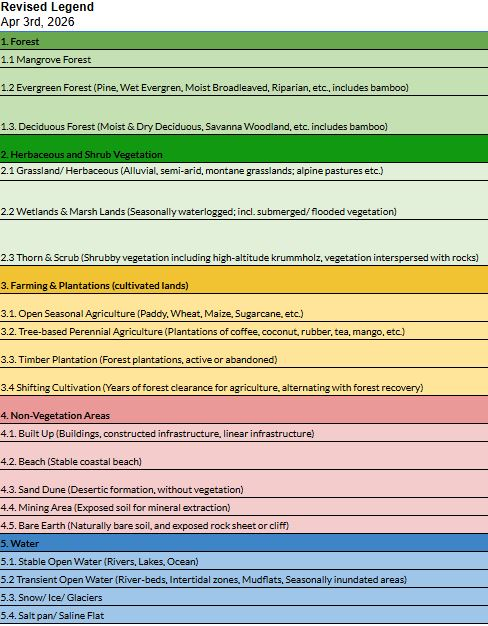
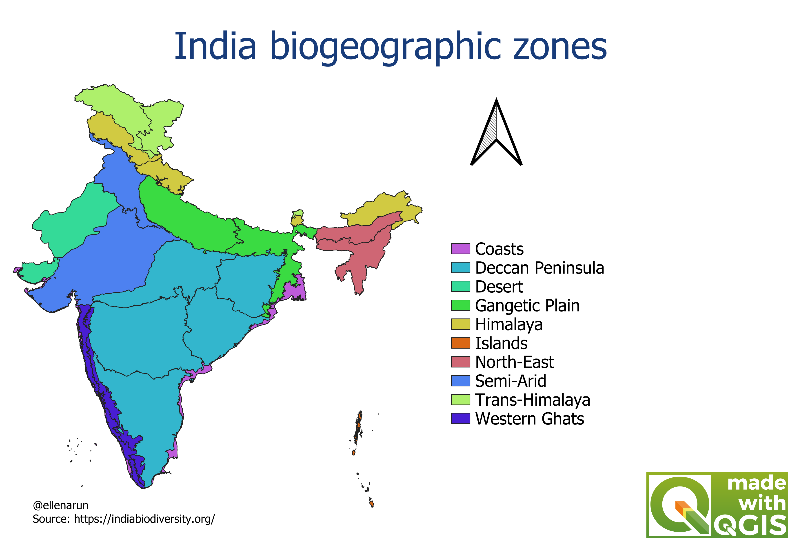

# IOLN Class Reference

This work for the Land Use Land Cover (LULC) class reference for the India Open Landcover Network (IOLN) work is adapted from the [Brazilian Mapbiomas Interpretation Keys](https://chave.lapig.iesa.ufg.br/en/).

The aim is threefold:

1. Come up with a definition for the different LULC classes that are relevant for the Indian context, across the 10 biogeographic regions defined as per the Rodgers and Panwar (1988) classification. [Download shape file biogeographic regions](https://github.com/EllenB/ioln-class-reference/releases/download/dataset/lyr_76_india_biogeographic.zip) 

3. How to identify these classes using True Color Composities (TCC), False Color Composites (FCC) and other visual interpretation keys.

4. Identify if there are a regional differences in the definition of the classes, the TCCs and FCCs and/or visual interpretation keys.  

  

<em>Figure 1. Classes for the India Open Landcover Mapping.</em>

  

<em>Figure 2. Classes for the India Open Landcover Mapping.</em>

## Scripts

*TO BE ADDED*

## References

[India Biodiversity Portal](https://indiabiodiversity.org/)

[Mapbiomas Brazil Interpretation Keys](https://chave.lapig.iesa.ufg.br/en/)

Rodgers, W. A., and H. S. Panwar. "Planning a wildlife protected area network in India." (1988).

## Contributors

This work is the result of members being part of the Working Group **Classification Guidance** of the IOLN: 

TO ADD

